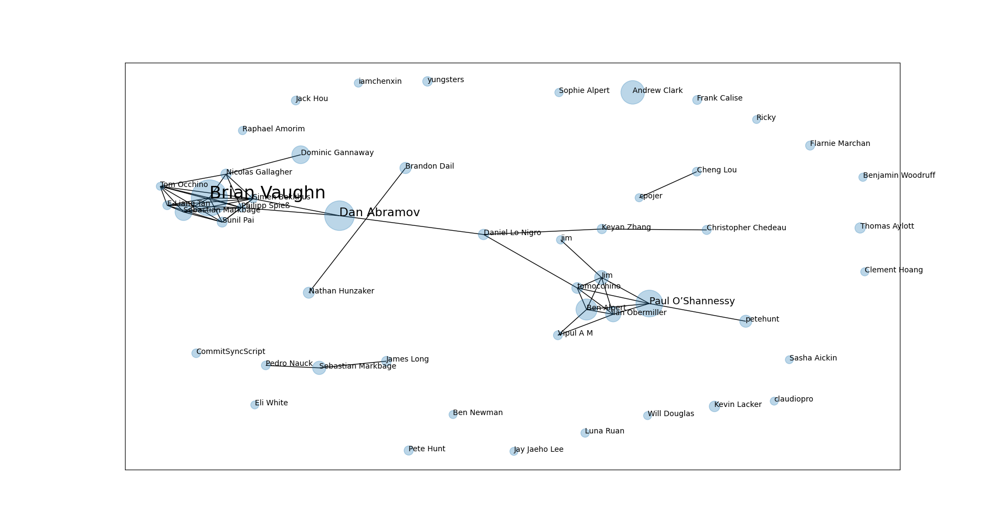
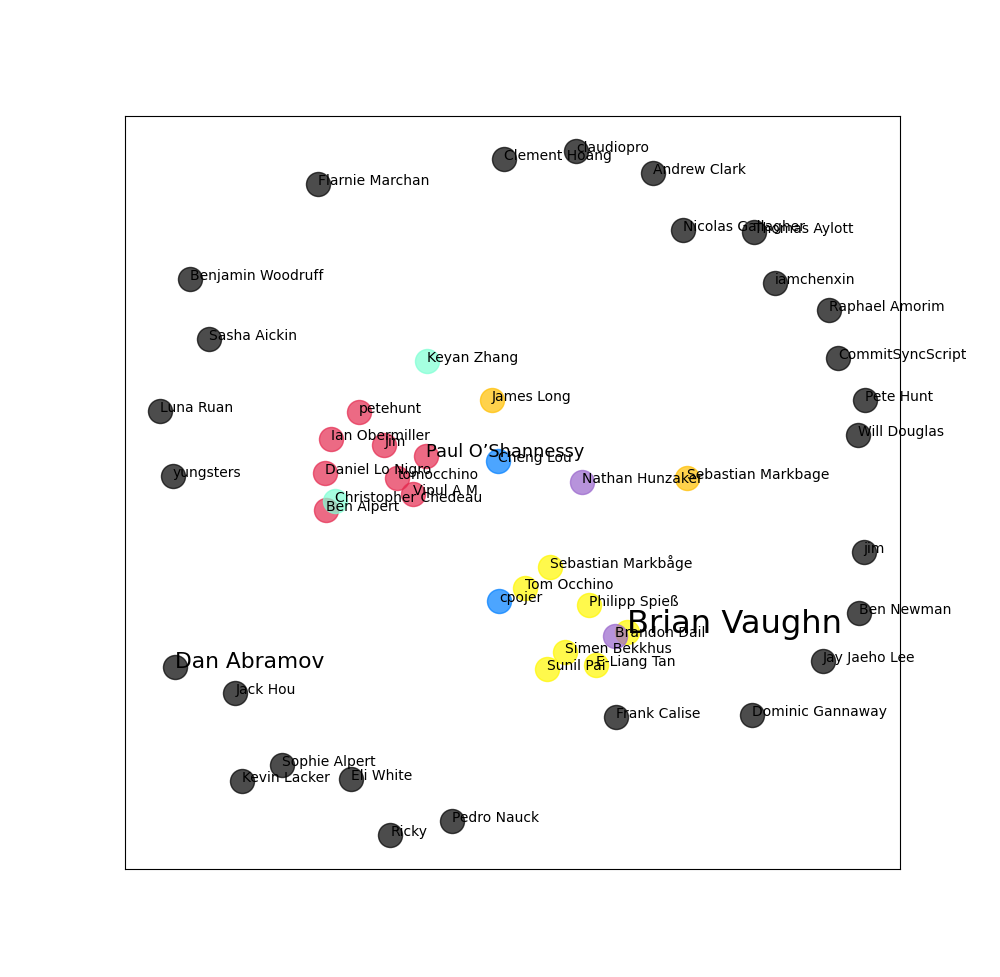

# RepositoryContributorsVisualization

This project visualizes relationships of contributors in [Facebook react project](https://github.com/facebook/react/graphs/contributors).

## Run project
1. clone this repo
2. run `python3 main.py`
3. some python packages installation may be needed(sklearn, networkx, numpy) - use pip3

This solution clones react project and iterates over all commits, so it may take some time(2 minutes for cloning and 3 minutes for iterating).  
Cache is saved, so next runs will be fast.

GitPython is used instead of remote git api because of limitations on number of requests.

A small research showed that it is impossible to use GitHub GraphQL for requesting changes statistics for a separate file in a commit.

## Feature extraction

Feature list for every contributor is a distribution of changes he or she made to files of project.
For example, if a contributor made 20% of changes in file A, 30% of his or her overall changes in file B, 50% of changes in file C, and 0% in other files, the corresponding feature list is [0.2, 0.3, 0.5, 0.0, ... 0.0].

This solution iterates over all commits and counts changes in every file for every contributor.

## Visualisation
### Weighted graph

The first approach takes first `N` edges in order of increasing distance.

On this picture connected contributors are supposed to have close context of work. Size of vertex and text is proportional to contributions.

### Clustering

The second approach used DBSCAN to cluster contributors. On the picture nodes of one color are supposed to have close context of work.
Black color is used for contributors without a cluster.

